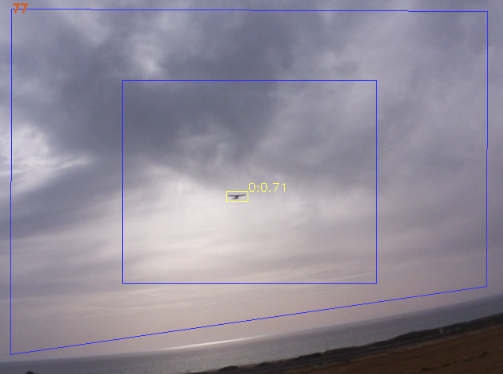

# Aerial Target Detection and Tracking 🎯📷

This repository contains Python code for real-time **detection** and **tracking** 
of aerial targets (currently rc planes) 
using camera-based computer vision. 
The system is built using **YOLOv8** for object detection 
and **OpenCV** for tracking and visualization.




## 🚀 Features

- ✅ Real-time object detection using YOLOv8 (Ultralytics)
- 🎯 Multi-object tracking with OpenCV or DeepSORT (not implemented yet!)
- 🧠 Easy integration with custom-trained detection models
- 💾 Option to save tracking logs and video output

## 📁 Project Structure

```text
aerial-tracking/
├── detection/           # Code related to YOLOv8 detection
│   └── detector.py
├── tracking/            # Tracking algorithms (e.g., OpenCV, DeepSORT)
│   └── tracker.py
├── dataset_utils/            # Utility functions for handling dataset for training
│   └── helpers.py
├── test_utils/               # Utility functions (grabbing, drawing, logging, etc.)
│   └── helpers.py
├── detector_tracker_record_test.py    # Main entry point for detection + tracking
├── requirements.txt     # Python dependencies
└── README.md
```

---

## 🛠️ Installation


### 📦 Dependencies

- [Ultralytics YOLOv8](https://docs.ultralytics.com/)
- [OpenCV](https://opencv.org/)
- [NumPy](https://numpy.org/)
- PyYAML for config loading

All dependencies are listed in \`requirements.txt\`.


### Setup

1. Clone the repository:

```bash
git clone https://github.com/yourusername/aerial-tracking.git
cd aerial-tracking
```

2. Set up a virtual environment (optional but recommended):

```bash
python -m venv venv
source venv/bin/activate  # or venv\Scripts\activate on Windows
```

3. Install the required packages:

```bash
pip install -r requirements.txt
```

### 🧠 Neural Network Model Setup

We currently use an [ultralytics-YOLOv8n](https://github.com/ultralytics/ultralytics) that has been transfer-learned with our own rc-plane images dataset.
The model parameter files are currently stored as github release assets.

The models should be downloaded from github release along with the corresponding version of the code.

Alternatively the `model_path` parameter can point to any ultralytics compatible model.  


This repo supports two types of neural network models:
1. .pt - better for development or in any case we have GPGPU
2. .onnx - better for CPU based platforms

The detectorTracker will handle them a little differently, but results should be very much the same.

*Note: Exporting a model to .onnx can be done in various ways.\
we currently support "simplified=True", and "uint8=False"

---
## usage

### ▶️ Running the System


Use the ***DetectorTracker*** object.

You can configure options using parameters:
- detector_model_file_path - path to detection deep learning model
- detection_frame_size - (image width, image height) for detection image
                                       image will automatically be resized or cropped to this size!
- detection_confidence_th - minimal confidence threshold for accepting object detection
- detector_use_cpu - force using CPU for detection even if GPU exists (used for timing tests)


Use \`detector_tracker_record_test.py\` to perform detection on an image library:

```bash
python detector_tracker_record_test.py
```


### 📊 Output

The ***DetectorTracker*** object outputs a list of tracks after each step.
Each track has: id, bbox, score


The \`detector_tracker_record_test.py\`:
- Real-time video display with bounding boxes and tracking IDs
- Optionally saves:
  - Processed video output (\`output.avi\`)


---

## 📌 Use Cases

- Drone detection in restricted airspace
- Wildlife monitoring
- Surveillance and perimeter defense
- Air traffic visualization in simulations

---

## 🧩 Future Enhancements

- Integration with radar or GPS fusion
- Non-convex object filtering (using Shapely)
- Web dashboard for remote monitoring
- Support for 3D tracking with stereo or depth cameras

## 📝 License

This project is licensed under the MIT License. See the [LICENSE](LICENSE) file for more information.

## 🤝 Contributing

Contributions, ideas, and feedback are welcome! Please open issues or pull requests if you'd like to help improve this project.

## 📬 Contact

For questions or support, feel free to reach out via [GitHub Issues](https://github.com/roee-lulav/deep_drone_detector/issues).
